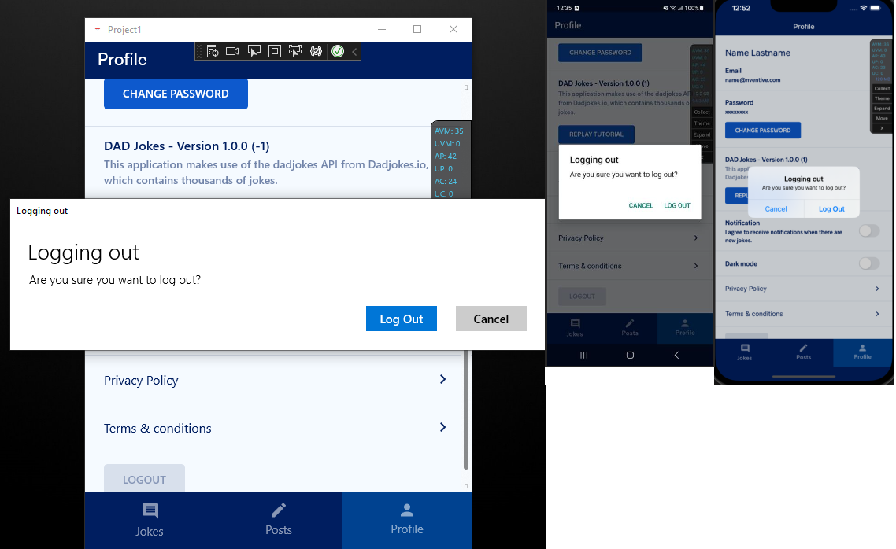
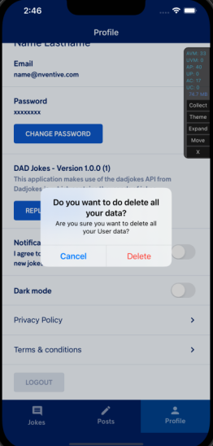

# Message Dialog Service

[](LICENSE)  

An abstraction layer for showing message dialogs in .Net applications.
This supports WinUI, Android and iOS.

```csharp
await _messageDialogService.ShowMessage(ct, mb => mb
   .Title("Oops!")
   .Content("Something went wrong.")
   .OkCommand()
);
```

## Preview
From left to right: WinUI, iOS and Android.


## Getting Started
Here is how to setup the service in your WinUI or mobile apps made with Uno Platform.

1. Install the `MessageDialogService.Uno.WinUI` NuGet package.

1. Create a `MessageDialogService` instance.
   
   ```csharp
   using Windows.ApplicationModel.Resources;
   
   // (...)

   var currentWindow = yourWindow; // Get the current window.;
   var dispatcherQueue = currentWindow.DispatcherQueue;
   var resourceLoader = ResourceLoader.GetForViewIndependentUse();
   var resourceResolver = resourceKey => resourceLoader.GetString(resourceKey);

   var messageDialogService = new MessageDialogService.MessageDialogService(
      dispatcherQueue,   
   #if __IOS__ || __ANDROID__
      new MessageDialogBuilderDelegate(resourceResolver)
   #else
      // On Windows, the builder delegate needs a window handle.
      new MessageDialogBuilderDelegate(
         resourceResolver,
         WinRT.Interop.WindowNative.GetWindowHandle(currentWindow)
      )
   #endif
   );
   ```

1. Use the service to prompt a message dialog.
   
   ```csharp
   await messageDialogService.ShowMessage(ct, mb => mb
      .Title("Oops!")
      .Content("Something went wrong.")
      .OkCommand()
   );
   ```

## Next Steps

### Localize the Default Buttons
If you plan on using the default commands (such as `OkCommand()`), you need to localize them. Here are the resource keys for the default commands.

| Command | Resource Key | Suggested Value (en) |
| ------- | ------------ | -------------------- |
| `OkCommand()` | `MessageDialog_Ok_Label` | `"Ok"` |
| `CancelCommand()` | `MessageDialog_Cancel_Label` | `"Cancel"` |
| `RetryCommand()` | `MessageDialog_Retry_Label` | `"Retry"` |
| `CloseCommand()` | `MessageDialog_Close_Label` | `"Close"` |

### Setup the Service using Dependency Injection
Here is some code showing how to setup the service using `Microsoft.Extensions.DependencyInjection`.

```csharp
private static IServiceCollection AddMessageDialog(this IServiceCollection services)
{
   return services
#if __IOS__ || __ANDROID__
      .AddSingleton<IMessageDialogBuilderDelegate>(s => new MessageDialogBuilderDelegate(
         key => s.GetRequiredService<IStringLocalizer>()[key]
      ))
#else
      .AddSingleton<IMessageDialogBuilderDelegate>(s => new MessageDialogBuilderDelegate(
         key => s.GetRequiredService<IStringLocalizer>()[key],
         WinRT.Interop.WindowNative.GetWindowHandle(App.Instance.CurrentWindow)
      ))
#endif
      .AddSingleton<IMessageDialogService, MessageDialogService.MessageDialogService>();
}
```

### Setup the Service in Test Projects
You can use the `AcceptOrDefaultMessageDialogService` in test projects to simulate a message dialog that always takes the accept or default command.

Here is some code showing how to set it up using `Microsoft.Extensions.DependencyInjection`.
First, you'll need to install the `MessageDialogService` NuGet package in your test project.

```csharp
private static IServiceCollection AddTestMessageDialog(this IServiceCollection services)
{
   return services.AddSingleton<IMessageDialogService, AcceptOrDefaultMessageDialogService>();
}
```


## Features

### Use Resource Keys for Dialog Content
You can use resource keys for the dialog title and content using `TitleResource` and `ContentResource`. This is useful for localization.

```csharp
await _messageDialogService.ShowMessage(ct, mb => mb
   .TitleResource("GenericErrorTitle")
   .ContentResource("GenericErrorContent")
   .OkCommand()
);
```

### Get the Result of the Dialog
You can get the result of the dialog using `ShowMessage`. This will return a `MessageDialogResult` enum value.

```csharp
var result = await _messageDialogService.ShowMessage(ct, mb => mb
   .Title("Logout")
   .Content("Are you sure you want to logout?")
   .CancelCommand()
   .AcceptCommand(acceptResourceKey: "Logout_Confirm")
);

if (result == MessageDialogResult.Accept)
{
   // Logout
}
```

### Use Your Own Return Type
When `MessageDialogResult` doesn't cover all your needs, you can use your own return type by using the `ShowMessage<TResult>` method. This will return a `TResult` value.

```csharp
public enum CustomDialogResult
{
   Option1,
   Option2,
   Option3,
   Option4,
   Option5
}

// (...)

var customResult = await _messageDialogService.ShowMessage<CustomDialogResult>(ct, mb => mb
   .Title("Some Custom Title")
   .Content("Some custom content.")
   .Command(CustomDialogResult.Option1, label: "Option 1")
   .Command(CustomDialogResult.Option2, label: "Option 2")
   .Command(CustomDialogResult.Option3, label: "Option 3")
   .Command(CustomDialogResult.Option4, label: "Option 4")
   .Command(CustomDialogResult.Option5, label: "Option 5")
);

switch (customResult)
{
   // Handle the result.
}
```

### Highlight Destructive Commands (iOS Only)
You can use the `isDesctructive` parameter of the `Command` and `CommandResource` methods to make the command red on iOS.
This option has no effect on Windows and Android.

```csharp
var result = await _messageDialogService.ShowMessage(ct, mb => mb
   .Title("Delete")
   .Content("Are you sure you want to delete the selected items?")
   .CancelCommand()
   .Command(MessageDialogResult.Accept, label: "Delete", isDestructive: true)
);

if (result == MessageDialogResult.Accept)
{
   // Delete
}
```

It will look like this:


## Legacy

If you want to know how to setup this service for UWP, you need to use version 1.x.x and check out [getting started with UWP](doc/GettingStartedUWP.md).

## Changelog

Please consult the [CHANGELOG](CHANGELOG.md) for more information about version
history.

## License

This project is licensed under the Apache 2.0 license - see the
[LICENSE](LICENSE) file for details.

## Contributing

Please read [CONTRIBUTING.md](CONTRIBUTING.md) for details on the process for
contributing to this project.

Be mindful of our [Code of Conduct](CODE_OF_CONDUCT.md).
